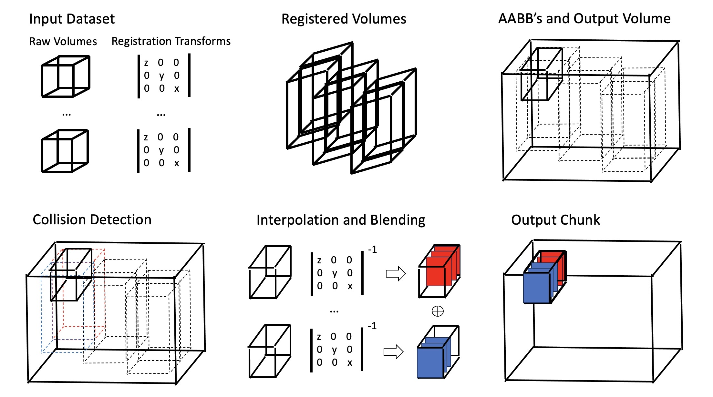

# aind-cloud-fusion

[](LICENSE)

[](https://github.com/semantic-release/semantic-release)


(Docs need to be updated)
Very important note about the input registration matrices
if BigStitcher is ever replaced:
- **Registration matrices are calculated in pixel space**--
resolution is **NOT** considered/factored into the derivation.

- All affine matrix stacks start in global pixel space wrt to an arbitrary origin (you would introduce your initial tile alignment from metadata here). Then, with every added matrix to each stack, the domains of each tile may diverge.

The idea of this matrix stack is b/c affine matrices do not compose. Each matrix added onto the stack refines the registration further, where good alignments are determined by finding a good fit
among interest point correspondances.
The proposed value of BigStitcher was solving for matrices respecting arbitrary n-way overlaps, but this is not the result in practice. Oh well.


### Features
- Lightweight, pure-python installation
- Support for generic image volume file formats (zarr, n5, tiff stack) and transforms (affine, flow field).
Transform types compose and can be used in sequence with one another.
- Modular image blending (max projection, linear averaging, deep blending)
- Parallel execution across multiple GPU's
- Deskewing and anisotropy correction

## Installation:
1) Run
```
git clone https://github.com/AllenNeuralDynamics/aind-cloud-fusion.git
```
Then, navigate to aind-cloud-fusion and install the package:
```
pip install .
```
By default, this project will install pytorch-cpu (because it is faster).
If you wish to use a GPU, please visit the official PyTorch website.

Reference scripts for how to use this library are found in the `scripts/` or `tests/` folder.

### High-Level Algorithm


1) Transform all volume boundaries by registration transforms
2) Calculate AABB's of transformed boundaries and store for reference. Use AABB's to calculate size of output volume.
3) Iterate through each output chunk and initialize a coordinate block. Determine chunk-AABB collision and send coordinate block through corresponding inverse registration transforms.
4) Interpolate intensity values from source images.
5) Blend all source chunks.
6) Write to output image.

### Usage
Notes on configurations:
- output_resolution:
Fusion algorithm operates entirely in continous absolute coordinates and rasterizes the output volume as a final step. By default, output resolution is set to (0.5, 0.5, 0.5) to produce uniformly sized output voxels. Other options for output_resolution may include the input resolution of the raw volumes or a resolution that upsamples/downsamples in specific dimensions to prevent aliasing caused by post-registration transforms.

- cell_size:
cell_size represents the size of the output that is colored. Fusion algorithm has option to swap between CPU and GPU runtimes. If operating with a GPU runtime, a good rule of thumb is to set the total size of cell_size equivalent to 50-70% of your local GPU memory. If operating with a CPU runtime, choose a cell_size that fits within RAM.

Additional notes on dataset:
- Registration transforms are expected in 'voxel'/'volume' basis. Input resolution, which scales the voxels to its absolute size, is expected as a separate input.
Volume boundaries, as described in high-level algorithm description, go through the following transformations in this order: `registration transforms` -> `input resolution scaling` -> `post-registration transforms` -> `output resolution scaling`.

## Contributing
Fusion features serveral generic components that may be extended to fit your use case:
- Dataset
- Transform
- BlendingModule
See 'blend.MaskedBlending' or 'io.BigStitcherDataset' for examples.

## Known Issues
- Dask array does not load input zarr with default input chunk size. Expose input chunk size parameter.
- Expose output zarr compression parameter.

## Suggested Features:
- Flow Field/Deformation Transform Implementation